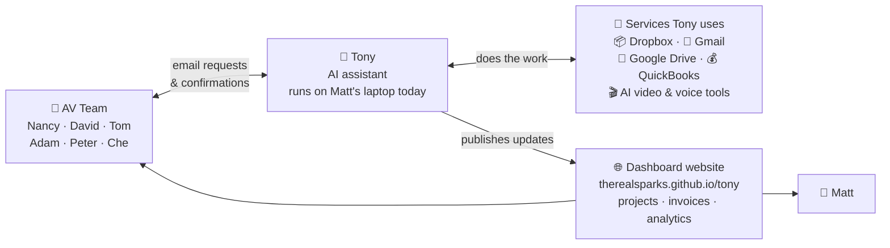
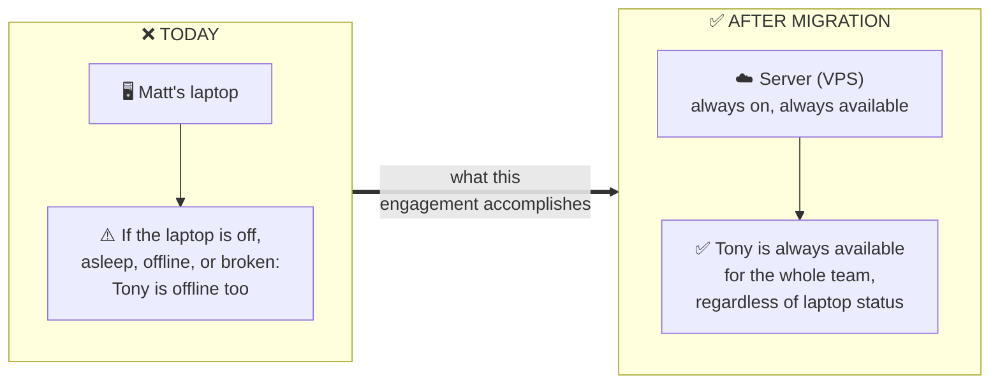

# Tony Docs

Central documentation hub for **Tony**, the AI assistant used at Austin Visuals.

## Who this is for

- **Right now:** Matt (founder of Austin Visuals) and the contractor onboarding to help productionize Tony.
- **Over time:** anyone on the AV team who needs to understand Tony, talk to him effectively, or extend what he does.

Tony is a real thing Matt built (on top of a framework called **OpenClaw**) that runs on his laptop today. He handles email-driven work for the team — filing client uploads to Dropbox, tracking projects, generating AI videos, publishing dashboards — and he's about to move off the laptop onto a server so the rest of the team can rely on him.

---

## 🖼️ The big picture

If you remember one thing about Tony, remember this diagram. Everything else is detail.

**How to read it:**

- **The team talks to Tony by email.** That's it — no app to log into. Send an email to `tony@austinvisuals.com` with a specific subject line and he does the thing. (See [Emailing Tony](guides/emailing-tony.md) for the list of commands.)
- **Tony does the actual work through the services on the right.** He has logins to Dropbox, Gmail, Google Drive, QuickBooks, and various AI tools. When an email asks him to file a client upload, he puts it in Dropbox. When it asks him to generate a video, he calls the AI service.
- **Tony publishes dashboards as a website.** Not a chat app, not a PDF — a live website anyone on the team can bookmark. Projects, invoices, analytics, health status.
- **Everything currently depends on Matt's laptop being on.** That's why we're here — see below.

---

## 🏗️ Today vs. after the migration

The whole point of this engagement is captured in these two boxes:

Tony is powerful but fragile right now — he's essentially an employee who only shows up when one specific laptop is awake. Moving him to a server (a "VPS") turns him into a real piece of infrastructure the whole team can depend on 24/7.

---

## 🔑 Key findings (read this first)

Plain-English summary of what I've figured out so far. The five things the client and I both need to know before moving forward:

1. **The GitHub repo I found and invited myself to (`therealsparks/tony`) is Tony's *output*, not his source code.** Think of it like a website builder publishing to a hosting account: Tony runs on Matt's laptop, generates dashboards, and pushes them to GitHub so they can be viewed at [therealsparks.github.io/tony](https://therealsparks.github.io/tony/). The repo itself doesn't contain Tony's "brain" — that lives in the workspace folder on Matt's laptop.

2. **⚠️ Matt said the `tony` repo "isn't in use." That is not accurate.** The repo is being written to every ~15 minutes right now, by Tony running on Matt's laptop. If we change things there without coordinating, we'll collide with his laptop's push loop and either break the live dashboards or overwrite our own changes. See [inventory/tony-repo.md](inventory/tony-repo.md) for the evidence (7,473 commits since 2026-03-21, with fresh ones arriving as I write this).

3. **Tony's actual source code is NOT in git anywhere.** The 175 scripts, the identity files (`AGENTS.md` / `SOUL.md` / `USER.md`), the three AgentSkills — the stuff that makes Tony *Tony* — live only as files on Matt's laptop. That's fragile: no version history, no rollback, no backup, no way for two people to collaborate on it. **We should stand up a second GitHub repo for the workspace itself** as an early step. The output repo is already in git; we just need the *source* to join it.

4. **The snapshot in Dropbox (`TonyWorkspace-2026-04-01.zip`) is already stale.** It was frozen on 2026-04-01; today is 2026-04-20. In that window, Tony's output repo has moved roughly **7,000 commits forward** — so the zip is a useful starting point, but not ground truth. Before we build anything on the VPS, we should ask Matt for a fresh sanitized snapshot from his laptop.

5. **The laptop is currently a single point of failure.** There's no CI/CD, no GitHub Actions, no automation on the server side — everything happens on Matt's laptop and pushes up. If his laptop is off, offline, or broken, Tony is offline. Migrating to a VPS fixes this, but we have to carefully hand the "heartbeat" cron job from his laptop to the server without leaving them both pushing at once.

---

## 📋 Questions for Matt

_(This section is worded as if I'm emailing Matt directly — easy to copy/paste when we have a conversation.)_

Hi Matt — a few things I've been chewing on as I dig into the material you shared. Most of these can wait, but the first two I'd like to align on soon because they shape a lot of the other decisions.

1. **Target OS for the VPS — can we go Linux?** Your handoff notes mention "Windows VPS, or Linux + Wine." I'd strongly steer us away from Wine: it emulates Windows inside Linux, which adds a whole class of compatibility bugs and defeats the reason to switch OS in the first place. The good news — OpenClaw itself is a Node.js package, which runs natively on Linux, and your own README notes reference "switch to the Linux launcher if preferred" and a `/opt/openclaw/workspace` install path. **Unless there's a Windows-only dependency I haven't spotted, Linux is cheaper, simpler, and the more production-ready choice.** Happy to default to Linux unless you have a reason to stick with Windows.

2. **Scope of this engagement.** Is this a pure lift-and-shift from your laptop to a VPS, or are we also closing gaps in what Tony can do today? The skill test matrix in the snapshot (`reports/bot_skill_test_matrix.md`) lists several "Blocked" capabilities — Dropbox file transfer, voiceover/music/sound-effect email handlers, Kling video, "MAKE FORMAL" drafting. If those are part of the job I'd like to plan for them.

3. **The `tony` repo is very much in use.** You mentioned it wasn't — just want to make sure we're talking about the same repo (`https://github.com/therealsparks/tony`). It's receiving commits every ~15 minutes from what looks like your laptop's cron job. If that's intentional and I'm safe to ignore / not touch it, great. If it's unexpected, I'd like to dig in.

4. **Source control for the workspace.** Tony's actual source code — the 175 scripts, his identity files, the skills — doesn't appear to be in git anywhere. I'd like to create a second repo (`austinvisuals/tony-workspace` or similar) so we have version history, backups, and a clean way to collaborate. Any objection?

5. **Fresh workspace snapshot.** The zip from 2026-04-01 is about three weeks stale and the live output has moved a lot since. Could you regenerate a fresh sanitized snapshot from your laptop before I start setting up the VPS? Same exclusions as before — no `.openclaw/secrets/`, no `memory/`.

6. **The other developer.** The `README.txt` inside the Dropbox bundle was addressed to a different developer (I'm guessing the Pakistani contractor who's been slow to respond). Are they still involved, or am I taking over this workstream entirely? Want to make sure we're not duplicating or conflicting.

7. **The 42-document SOP corpus.** The processes playbook in the snapshot references 42 documents but only 15 were ingested. Can I get view access to the remaining 27 DOCX files in your Google Drive? Understanding the full business context will help me figure out where Tony needs to grow.

8. **"Seven focus items" priority stack.** `docs/feature-backlog.md` in the publish repo mentions "Matt's seven current focus items for the upcoming VPS build." Can you share that list? Sounds like the scope doc for this engagement.

9. **`site/` vs `site-deploy/` folders in the publish repo.** Both contain the same 4 files. Is one of them legacy / deprecated, or is this a staging flow I should preserve?

10. **Secrets transfer.** Eventually I'll need credentials to stand Tony up on a VPS: Dropbox API token, Gmail OAuth for `bot@` / `tony@`, Google service-account JSON, QuickBooks OAuth, GitHub PAT for the publish repo, ElevenLabs / Replicate / Vertex AI / GA4 keys. No rush — we should discuss a secure handoff method (1Password, encrypted file, fresh tokens) before you send anything.

---

## 🗺️ Deep dives

### Architecture

How all the pieces fit together. Four diagrams walk through the system.

- [Architecture overview](architecture/README.md) — start here
- [1. Components — what talks to what](architecture/01-components.md)
- [2. Publish loop — how dashboards stay fresh](architecture/02-publish-loop.md)
- [3. Command loop — how the team triggers actions](architecture/03-command-loop.md)
- [4. VPS migration — target state + cutover gotchas](architecture/04-vps-migration.md)

### Inventory

What exists today and where each piece came from.

- [ClawLauncher-Windows bundle](inventory/clawlauncher-windows.md) — the Windows runtime and its installers
- [TonyWorkspace snapshot (2026-04-01)](inventory/tony-workspace.md) — Tony's "brain" files, frozen on April 1 ⚠️ stale
- [tony repo (live publish target)](inventory/tony-repo.md) — the GitHub Pages site ⚠️ actively in use

### Migration

What still needs to happen before we can productionize Tony.

- [Missing pieces](migration/missing-pieces.md) — what we still need from Matt

### Guides

Practical how-tos for using Tony day-to-day.

- [Emailing Tony](guides/emailing-tony.md) — for AV team members who want Tony to do something

---

## A note on tone

Where the language in these docs reads like correspondence — *"we should…"*, *"worth asking Matt about…"*, *"I suspect…"* — treat that as notes-in-progress. As questions get answered and assumptions get confirmed, the correspondence-style prose will firm up into stated fact.

The `guides/` section is different: those pages are drawn only from confirmed sources and should read as evergreen reference from day one.

---

_Maintained by the engineering contractor for Austin Visuals. Last structural update: 2026-04-20._
