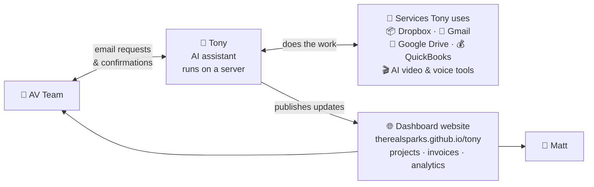

# Tony Docs

Central documentation hub for **Tony**, the AI assistant used at Austin Visuals.

## Who this is for

- **Right now:** Matt (founder of Austin Visuals) and the contractor taking inventory of the system.
- **Over time:** anyone on the AV team who needs to understand Tony, use it effectively, or extend its capabilities.

Tony is an AI assistant built on the **OpenClaw** framework. It handles email-driven work for the team — filing client uploads to Dropbox, tracking projects, generating AI videos, publishing dashboards — and runs on a server Matt operates.

This doc describes the moving parts, how they connect, and where each piece of information lives. It's an inventory, not a proposal.

---

## 🗺️ System Overview

**How to read it:**

- **Team members interact by email.** There is no web UI. Messages sent to `tony@austinvisuals.com` with a specific subject line are routed to a handler. See [Emailing Tony](guides/emailing-tony.md) for supported commands.
- **Work is performed against external services.** Tony holds credentials for Dropbox, Gmail, Google Drive, QuickBooks, and various AI APIs. Each handler calls the appropriate service — e.g. an upload command writes to Dropbox; a video-generation command calls Google Veo.
- **Output is published as a static website.** Dashboards (projects, invoices, analytics, health status) are generated as HTML and JSON and served via GitHub Pages.

---

## 🔑 Key observations

1. **`therealsparks/tony` is a publish target, not source code.** The server generates HTML/JSON dashboards and pushes them here. Source lives on the server.

2. **The repo gets a heartbeat commit every ~15 minutes** — 7,400+ commits since March 21. Content pushes happen on top whenever Tony does real work.

3. **No source repo was delivered.** The `TonyWorkspace-2026-04-01.zip` snapshot has 175 scripts and 3 skills, but it's a pre-migration artifact. The live server may have diverged.

4. **Both delivered bundles are pre-migration.** They describe Tony as it ran on Matt's laptop. Useful for understanding the architecture; not a mirror of the live system.

5. **The running system is only indirectly visible.** Observable surfaces: the publish repo (output) and the workspace snapshot (pre-migration source). No direct access to the server, its `memory/`, or `secrets/`.

---

## 📋 Questions for Matt

_(This section is worded as if speaking to Matt directly — easy to copy/paste for a conversation.)_

Hi Matt — a few things I'd still like to understand now that the migration is done:

1. **Access to the running system.** Can I get SSH or console access to the server Tony runs on? Being able to read the live source, logs, and config directly would speed up anything I need to look into. Right now my only windows into Tony are the publish repo and your old snapshot.

2. **Current source of truth for Tony's source code.** Is Tony's current workspace (scripts, skills, identity files) tracked in a repo I could pull from? If not, it'd be useful to have one — partly for backup, partly so we have a clean way to see what he's running today vs the April 1 snapshot I was given.

3. **The other developer.** The `README.txt` inside the Dropbox bundle was addressed to a different developer. Are they still involved, or am I taking over this workstream entirely? Just want to make sure we're not duplicating or conflicting.

4. **The 42-document SOP corpus.** The processes playbook in the snapshot references 42 documents but only 15 were ingested. Can I get view access to the remaining 27 DOCX files in your Google Drive? Understanding the full business context will help me figure out where Tony could grow.

5. **"Seven focus items" priority stack.** `docs/feature-backlog.md` in the publish repo mentions "Matt's seven current focus items." Can you share that list? Sounds like the roadmap for what Tony should tackle next.

6. **`site/` vs `site-deploy/` folders in the publish repo.** Both contain the same 4 files. Is one of them legacy / deprecated, or is this a staging flow worth preserving?

---

## 🗺️ Deep dives

### Architecture

How all the pieces fit together. Three diagrams walk through the system.

- [Architecture overview](architecture/README.md) — start here
- [1. Components — what talks to what](architecture/01-components.md)
- [2. Publish loop — how dashboards stay fresh](architecture/02-publish-loop.md)
- [3. Command loop — how the team triggers actions](architecture/03-command-loop.md)

### Inventory

What exists in the delivered material and what each piece represents.

- [ClawLauncher-Windows bundle](inventory/clawlauncher-windows.md) — historical Windows runtime bundle (pre-migration)
- [TonyWorkspace snapshot (2026-04-01)](inventory/tony-workspace.md) — historical source snapshot (pre-migration)
- [tony repo](inventory/tony-repo.md) — the live GitHub Pages publish target

### Guides

Practical how-tos for using Tony day-to-day.

- [Emailing Tony](guides/emailing-tony.md) — for AV team members who want Tony to do something

---

## Live document

This is a working inventory; sections will be revised as open questions are answered. The `guides/` section is drawn from confirmed sources and intended as stable reference.
