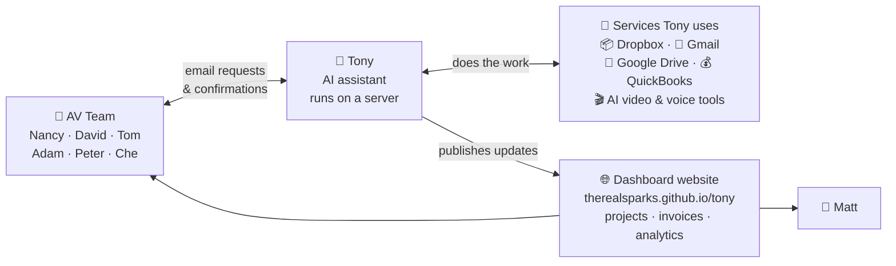

# Tony Docs

Central documentation hub for **Tony**, the AI assistant used at Austin Visuals.

## Who this is for

- **Right now:** Matt (founder of Austin Visuals) and the contractor taking inventory of the system.
- **Over time:** anyone on the AV team who needs to understand Tony, talk to him effectively, or extend what he does.

Tony is a real thing Matt built on top of a framework called **OpenClaw**. He handles email-driven work for the team — filing client uploads to Dropbox, tracking projects, generating AI videos, publishing dashboards — and runs on a server Matt operates.

This doc describes the moving parts, how they connect, and where each piece of information lives. It's an inventory, not a proposal.

---

## 🖼️ The big picture

If you remember one thing about Tony, remember this diagram. Everything else is detail.

**How to read it:**

- **The team talks to Tony by email.** That's it — no app to log into. Send an email to `tony@austinvisuals.com` with a specific subject line and he does the thing. (See [Emailing Tony](guides/emailing-tony.md) for the list of commands.)
- **Tony does the actual work through the services on the right.** He has logins to Dropbox, Gmail, Google Drive, QuickBooks, and various AI tools. When an email asks him to file a client upload, he puts it in Dropbox. When it asks him to generate a video, he calls the AI service.
- **Tony publishes dashboards as a website.** Not a chat app, not a PDF — a live website anyone on the team can bookmark. Projects, invoices, analytics, health status.

---

## 🔑 Key observations

Summary of what's true about Tony today, based on what's directly visible from the GitHub repo and the files in dropbox that were shared with Niaz.

1. **The GitHub repo `therealsparks/tony` is Tony's *published output*, not his source code.** Tony runs on a server, generates HTML/JSON dashboards, and pushes them to this repo. GitHub Pages serves them at [therealsparks.github.io/tony](https://therealsparks.github.io/tony/). The repo itself doesn't contain Tony's "brain" — that lives in a workspace directory on the server.

2. **The repo is actively written to every ~15 minutes.** A heartbeat job on the server rewrites `status.json` and pushes. Content-update pushes happen on top of that whenever Tony does real work (syncs QuickBooks, pulls GA4, processes an email, etc.). 7,400+ commits since 2026-03-21 — see [inventory/tony-repo.md](inventory/tony-repo.md).

3. **Tony's source code isn't in a repo the contractor has seen.** The only source we have direct visibility into is the pre-migration `TonyWorkspace-2026-04-01.zip` snapshot (175 scripts, identity files, 3 AgentSkills). That snapshot is a historical artifact — Tony has been running on the server for weeks, so the live source may have evolved since the snapshot was cut.

4. **The delivered bundles are pre-migration artifacts.** `ClawLauncher-Windows.zip` and `TonyWorkspace-2026-04-01.zip` describe Tony as he ran on Matt's laptop before the migration. They're useful reference for understanding the architecture — not a mirror of the live system.

5. **Our view of Tony is indirect.** We see him through the publish repo (his output) and the historical bundles (his pre-migration source). We don't currently have direct access to the running server or its `memory/` and `secrets/` folders.

---

## 📋 Questions for Matt

_(This section is worded as if speaking to Matt directly — easy to copy/paste for a conversation.)_

Hi Matt — a few things I'd still like to understand now that the migration is done:

1. **Access to the running system.** Can I get SSH or console access to the server Tony runs on? Being able to read the live source, logs, and config directly would speed up anything I need to look into. Right now my only windows into Tony are the publish repo and your old snapshot.

2. **Current source of truth for Tony's source code.** Is Tony's current workspace (scripts, skills, identity files) tracked in a repo I could pull from? If not, it'd be useful to have one — partly for backup, partly so we have a clean way to see what he's running today vs the April 1 snapshot I was given.

3. **The other developer.** The `README.txt` inside the Dropbox bundle was addressed to a different developer. Are they still involved, or am I taking over this workstream entirely? Just want to make sure we're not duplicating or conflicting.

4. **The 42-document SOP corpus.** The processes playbook in the snapshot references 42 documents but only 15 were ingested. Can I get view access to the remaining 27 DOCX files in your Google Drive? Understanding the full business context will help me figure out where Tony could grow.

5. **"Seven focus items" priority stack.** `docs/feature-backlog.md` in the publish repo mentions "Matt's seven current focus items." Can you share that list? Sounds like the roadmap for what Tony should tackle next.

6. **`site/` vs `site-deploy/` folders in the publish repo.** Both contain the same 4 files. Is one of them legacy / deprecated, or is this a staging flow worth preserving?

---

## 🗺️ Deep dives

### Architecture

How all the pieces fit together. Three diagrams walk through the system.

- [Architecture overview](architecture/README.md) — start here
- [1. Components — what talks to what](architecture/01-components.md)
- [2. Publish loop — how dashboards stay fresh](architecture/02-publish-loop.md)
- [3. Command loop — how the team triggers actions](architecture/03-command-loop.md)

### Inventory

What exists in the delivered material and what each piece represents.

- [ClawLauncher-Windows bundle](inventory/clawlauncher-windows.md) — historical Windows runtime bundle (pre-migration)
- [TonyWorkspace snapshot (2026-04-01)](inventory/tony-workspace.md) — historical source snapshot (pre-migration)
- [tony repo](inventory/tony-repo.md) — the live GitHub Pages publish target

### Guides

Practical how-tos for using Tony day-to-day.

- [Emailing Tony](guides/emailing-tony.md) — for AV team members who want Tony to do something

---

## A note on tone

Where the language in these docs reads like correspondence — *"worth asking Matt about…"*, *"I suspect…"* — treat that as notes-in-progress. As questions get answered, the correspondence-style prose will firm up into stated fact.

The `guides/` section is different: those pages are drawn only from confirmed sources and should read as evergreen reference.

---

_Maintained by the engineering contractor for Austin Visuals. Last structural update: 2026-04-21._
