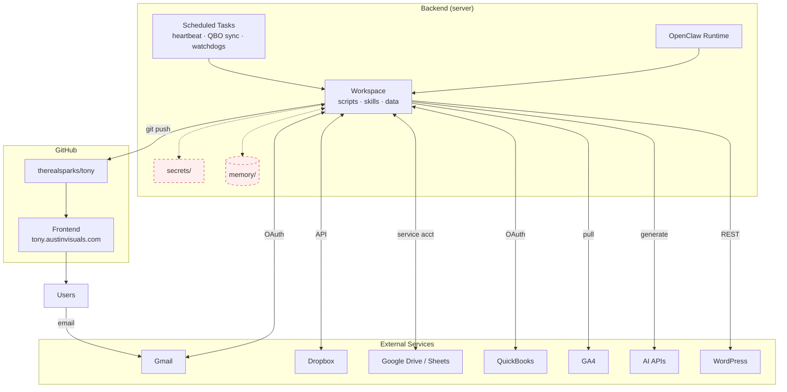

# 1. Components

[← architecture index](README.md) · [← docs home](../README.md)

The system is split into two halves: a **backend** (the server where Tony runs) and a **frontend** (the dashboard site users visit). The backend integrates with external services to do its work; the frontend is simply the published output.

> **Red-dashed boxes** — `secrets/` and `memory/` live on the server and were not included in the delivered material.

## Components

- **OpenClaw Runtime** — The Node.js process Tony runs in. Loads the workspace on startup and handles each session.
- **Scheduled Tasks** — The host's job scheduler. Fires the 15-minute heartbeat, QuickBooks sync, and watchdog processes.
- **Workspace** — The source directory: identity/policy files, 175 automation scripts, 3 skills, and reference data.
- **Secrets** — API credentials and OAuth tokens, kept separate from the workspace. Not in the delivered material.
- **Memory** — Between-session state. Managed by the runtime automatically.
- **External Services** — Seven integrations the workspace scripts call via OAuth or API keys.
- **Frontend** — HTML and JSON dashboards pushed to `therealsparks/tony` and served at `tony.austinvisuals.com`.

---

**Next:** [Publish loop →](02-publish-loop.md)
