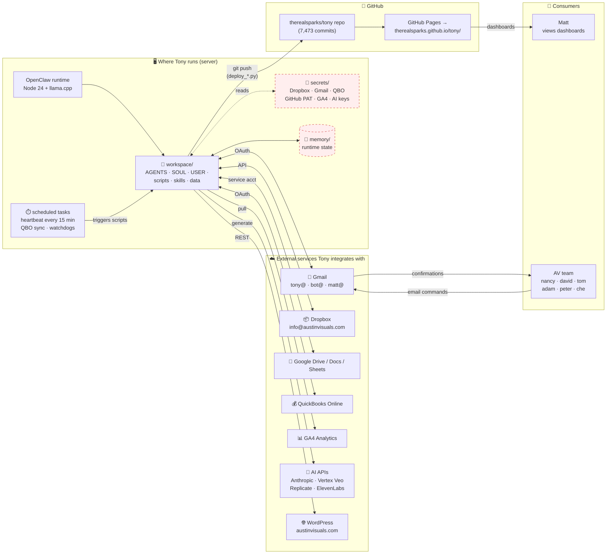

# 1. Components — what talks to what

[← architecture index](README.md) · [← docs home](../README.md)

Components are grouped into three domains: the host server (runtime, workspace, scheduled tasks), external services the system integrates with, and the GitHub publish target.

> **🔴 Red-dashed boxes = not visible in the delivered material.** `secrets/` and `memory/` live on the server and were not included in the bundles shared to date.

## Components

- **OpenClaw runtime** — The Node.js runtime. Installs the `openclaw` package, `node-llama-cpp`, and SDKs for each integrated service.
- **Workspace** — Source directory loaded each session: identity and policy files, automation scripts, skills, and reference data.
- **Secrets** — Credentials, kept separate from the workspace so the workspace can be shared without leaking keys. Not included in the delivered material.
- **Memory** — Between-session state. Regenerates automatically.
- **Scheduled tasks** — The host's job scheduler (cron, systemd timers, or Windows Task Scheduler — not determined from the delivered material). Runs the 15-minute heartbeat, QuickBooks sync, and watchdogs.
- **External services** — Seven external integrations, accessed via OAuth tokens or service-account keys.
- **GitHub repo + Pages** — The publish target. HTML and JSON dashboards are pushed to `therealsparks/tony` and served by GitHub Pages.

---

**Next:** [Publish loop →](02-publish-loop.md)
