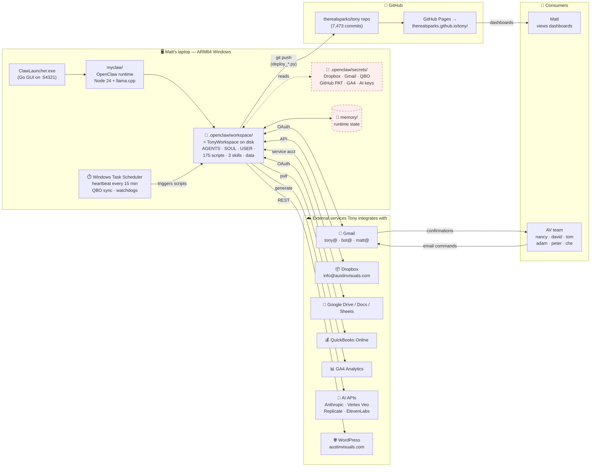

# 1. Components — what talks to what

[← architecture index](README.md) · [← docs home](../README.md)

This is the big-picture map of the Tony system as it runs today. Matt's laptop is the brain; everything else is either an external service Tony talks to or an output Tony produces.

> **🔴 Red-dashed boxes = not delivered yet.** Need from Matt: `.openclaw/secrets/` and `memory/` before we can run anything ourselves. See [migration/missing-pieces.md](../migration/missing-pieces.md).

## What each piece is, in plain terms

- **ClawLauncher.exe** — A small GUI app Matt clicks to start Tony. It opens a local web page at `localhost:54321` and runs the `openclaw` command under the hood.
- **myclaw/** — The actual Tony runtime. It's a Node.js install with ~373 packages, including the `openclaw` package, `node-llama-cpp`, and SDKs for every service Tony talks to.
- **Workspace** — The folder Tony reads from every session: identity files (who he is), 175 automation scripts (what he does), three skills (specialized capabilities), and data (projects, processes, reference).
- **Secrets** — Credentials Tony needs. Stored separately from the workspace so sharing the workspace doesn't leak keys. **Not included in what Matt shared with us.**
- **Memory** — Tony's notes to himself between sessions. Regenerates on its own.
- **Task Scheduler** — Windows cron. Fires Tony's periodic jobs: the 15-minute heartbeat, QuickBooks sync, watchdogs.
- **External services** — The seven buckets Tony talks to. He's got OAuth tokens or API keys for each.
- **GitHub repo + Pages** — The publish target. Tony generates HTML/JSON dashboards, pushes them to `therealsparks/tony` on GitHub, and GitHub Pages serves them as a website.

---

**Next:** [Publish loop →](02-publish-loop.md)
