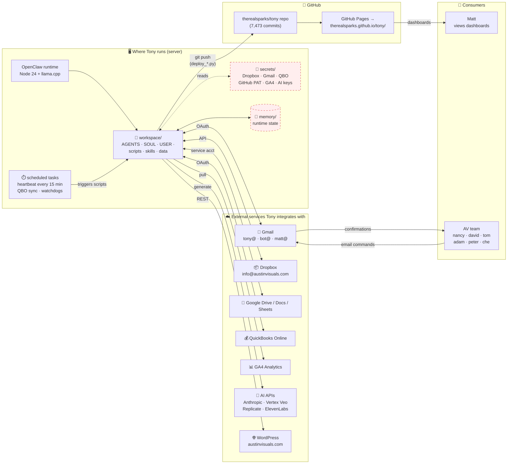

# 1. Components — what talks to what

[← architecture index](README.md) · [← docs home](../README.md)

This is the big-picture map of the Tony system as it runs today. The server is the brain; everything else is either an external service Tony talks to or an output Tony produces.

> **🔴 Red-dashed boxes = not visible to the contractor.** `secrets/` and `memory/` live on the server and weren't part of the delivered bundles.

## What each piece is, in plain terms

- **OpenClaw runtime** — The actual Tony engine. A Node.js install that includes the `openclaw` package, `node-llama-cpp`, and SDKs for every service Tony talks to.
- **Workspace** — The folder Tony reads from every session: identity files (who he is), automation scripts (what he does), skills (specialized capabilities), and data (projects, processes, reference).
- **Secrets** — Credentials Tony needs. Stored separately from the workspace so sharing the workspace doesn't leak keys. Not part of what the contractor has been given.
- **Memory** — Tony's notes to himself between sessions. Regenerates on its own.
- **Scheduled tasks** — The host's job scheduler (could be `cron`, `systemd` timers, or Windows Task Scheduler — the contractor hasn't seen the server directly). Fires Tony's periodic jobs: the 15-minute heartbeat, QuickBooks sync, watchdogs.
- **External services** — The seven buckets Tony talks to. He's got OAuth tokens or API keys for each.
- **GitHub repo + Pages** — The publish target. Tony generates HTML/JSON dashboards, pushes them to `therealsparks/tony` on GitHub, and GitHub Pages serves them as a website.

---

**Next:** [Publish loop →](02-publish-loop.md)
