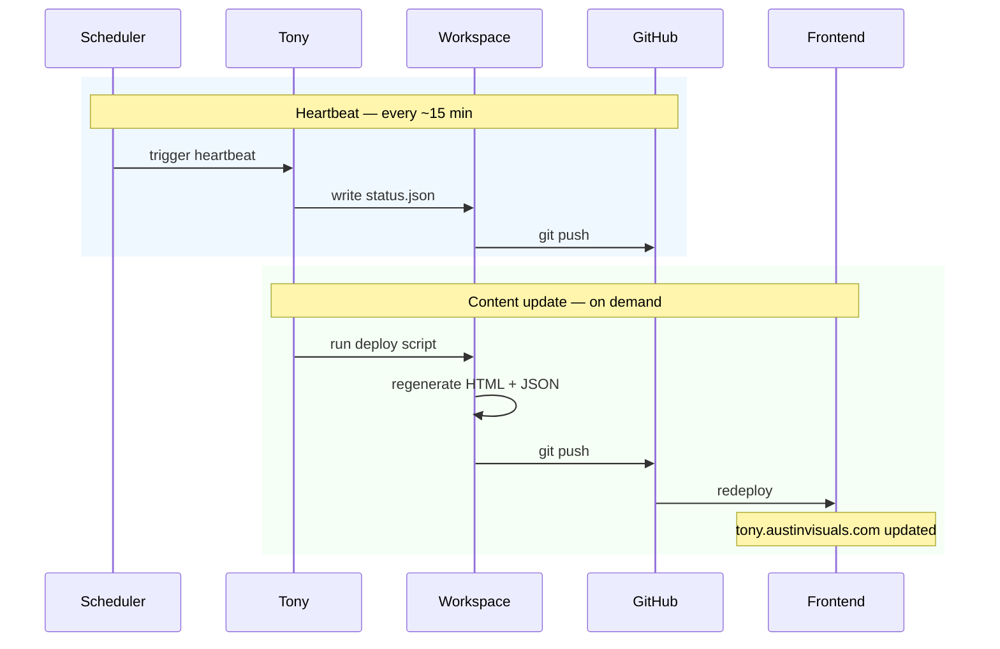

# 2. Publish loop

[← architecture index](README.md) · [← docs home](../README.md)

Two independent processes keep the frontend current: a **heartbeat** that runs every ~15 minutes, and **content updates** that fire whenever Tony processes real work. Together they account for the 7,000+ commits on the repo since March 2026.

## Heartbeat (blue)

Liveness signal. Every ~15 minutes the scheduler triggers a heartbeat: Tony writes the current timestamp and any known issues to `status.json`, commits, and pushes. A missing heartbeat means the runtime or host has stalled. The status page at `tony.austinvisuals.com/status-page.html` shows the last heartbeat time.

## Content updates (green)

Triggered whenever a handler or scheduled job changes state — a QuickBooks sync regenerates `invoices.html`, a GA4 pull regenerates `analytics.html`, a new-project email updates `projects.json`. Each has its own `deploy_*.py` script in the workspace.

## Notes

- No CI/CD on the GitHub side (no Actions, no hooks). All publish activity is server-driven.
- The GitHub PAT used for pushing lives in the server's `secrets/` directory.
- Direct edits on GitHub will be overwritten by the next server push.

---

**Prev:** [← Components](01-components.md) · **Next:** [Command loop →](03-command-loop.md)
