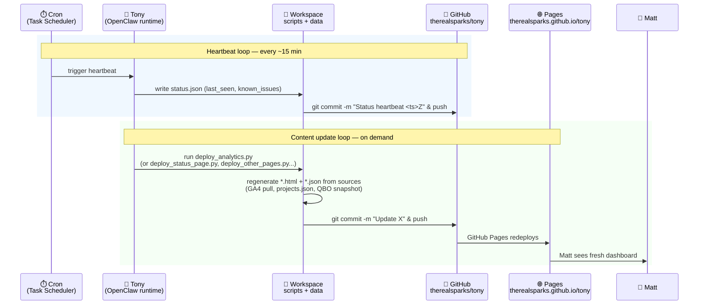

# 2. Publish loop — how dashboards stay fresh

[← architecture index](README.md) · [← docs home](../README.md)

Every ~15 minutes a cron job on Matt's laptop fires a **heartbeat**. Separately, whenever Tony actually does something (gets an email, runs a sync, processes an upload), a `deploy_*.py` script regenerates the affected HTML/JSON and pushes it. This is why the `tony` repo has 7,000+ commits in a month.

## Two independent rhythms

**Heartbeat (blue).** A "Tony is alive" signal. Every ~15 minutes a Windows scheduled task runs a small job that writes the current timestamp and known issues into `status.json`, commits it, and pushes. If heartbeats stop arriving in the repo, something is wrong with Tony (or with Matt's laptop). This is also what makes [therealsparks.github.io/tony/status-page.html](https://therealsparks.github.io/tony/status-page.html) show a "last seen" time.

**Content updates (green).** Happen whenever Tony does real work. The QuickBooks syncer pulls invoices → regenerates `invoices.html` → pushes. A GA4 pull → regenerates `analytics.html` → pushes. A new project email → updates `projects.json` → regenerates `project-status.html` → pushes. Each of these is a separate `deploy_*.py` script (there are about half a dozen of them).

## Why this matters for the migration

- The heartbeat must move from Matt's laptop to the VPS. Both machines pushing at once = merge conflicts on every cycle.
- The `github-token.txt` (GitHub Personal Access Token) Tony uses to push is a credential we'll need on the VPS. See [migration/missing-pieces.md](../migration/missing-pieces.md).
- There's no CI/CD — everything is driven from the pushing machine. That's a feature for now (simple) but could be improved post-migration (e.g. replace some deploy scripts with GitHub Actions).

---

**Prev:** [← Components](01-components.md) · **Next:** [Command loop →](03-command-loop.md)
