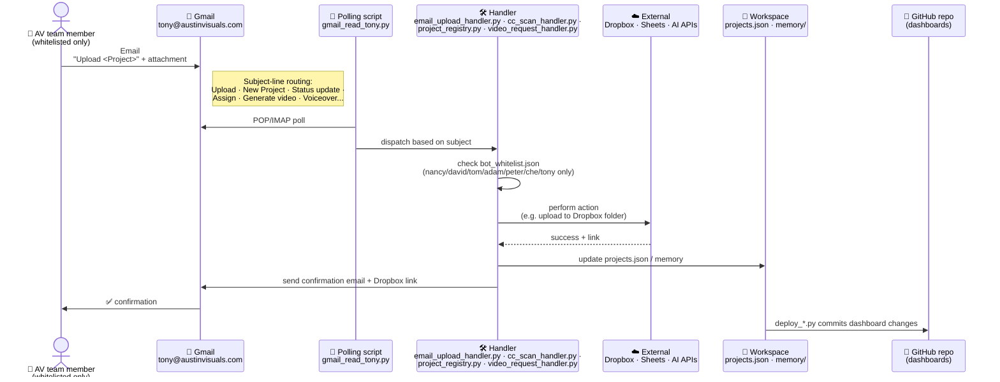

# 3. Command loop — how a team member triggers an action

[← architecture index](README.md) · [← docs home](../README.md)

This is the primary way Tony is *used*. The AV team doesn't log into anything — they just email `tony@austinvisuals.com` (or CC him on a client thread). A Gmail-polling script picks it up, dispatches to a handler, the handler does the work against external services, and replies.

## What this unlocks for the team

Anyone whitelisted can do the following with just an email:

- **File an attachment to a project's Dropbox folder** (forward + subject line `Upload <Project>`)
- **Create a new Dropbox project folder with the standard 7 subfolders** (subject `New Project <Name>`)
- **Passively file anything CC'd to Tony** on a client thread
- **Log status updates, check project status, assign staff, set due dates**
- **Generate an AI video via Google Veo**

Full list of working commands and what they do is in the [Emailing Tony guide](../guides/emailing-tony.md).

## What's blocked today

Per `reports/bot_skill_test_matrix.md` in the workspace snapshot, several commands that the team *might* expect to work are currently **not implemented**:

- `Dropbox transfer <Project> → <Owner>` — no handler written
- `List client folders` — no handler written
- `Voiceover request`, `Sound effect request`, `Generate music` — manual test scripts exist but no email pipelines
- `Kling video — <Shot>` — CLI exists, no email glue
- `MAKE FORMAL` / `PERSONALIZE NOTES` prefixes — advertised but no drafting pipeline

These are either scope to close during migration, or things we should tell the team not to try yet.

## Why this matters for the migration

- All of this glue is in the **workspace** (the 175 Python scripts in `scripts/`), not in the repo we can currently see on GitHub. Without the workspace, we have no command loop.
- The whitelist lives in `data/bot_whitelist.json` — easy to extend, but a person has to edit the file and Tony has to restart (or reload) to see the change. Worth revisiting post-migration.
- Gmail uses OAuth — we'll need fresh tokens on the VPS.

---

**Prev:** [← Publish loop](02-publish-loop.md) · **Next:** [VPS migration →](04-vps-migration.md)
