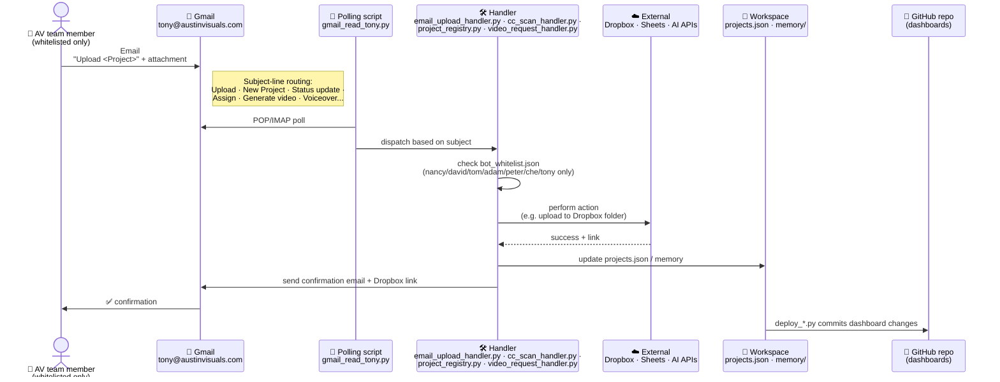

# 3. Command loop — how a team member triggers an action

[← architecture index](README.md) · [← docs home](../README.md)

The primary usage surface for Tony. Team members send email to `tony@austinvisuals.com` (or CC/BCC on client threads). A Gmail polling script reads incoming messages, dispatches them to a handler based on the subject line, the handler executes against the relevant external service, and a confirmation is emailed back.

## Supported actions

Whitelisted senders can perform the following by email:

- **File an attachment to a project's Dropbox folder** (forward + subject line `Upload <Project>`)
- **Create a new Dropbox project folder with the standard 7 subfolders** (subject `New Project <Name>`)
- **Passively file anything CC'd to Tony** on a client thread
- **Log status updates, check project status, assign staff, set due dates**
- **Generate an AI video via Google Veo**

Full list of working commands and what they do is in the [Emailing Tony guide](../guides/emailing-tony.md).

## Unsupported commands

Per `reports/bot_skill_test_matrix.md` in the workspace snapshot, the following commands are referenced elsewhere but **not implemented**:

- `Dropbox transfer <Project> → <Owner>` — no handler written
- `List client folders` — no handler written
- `Voiceover request`, `Sound effect request`, `Generate music` — manual test scripts exist but no email pipelines
- `Kling video — <Shot>` — CLI exists, no email glue
- `MAKE FORMAL` / `PERSONALIZE NOTES` prefixes — advertised but no drafting pipeline

Each would require additional handler implementation.

## Notes

- The handler code lives in the **workspace** (~175 Python scripts in `scripts/`). The only visible copy is the 2026-04-01 pre-migration snapshot; the live copy on the server may have diverged.
- The whitelist lives in `data/bot_whitelist.json`. Additions require editing the file on the server and reloading the runtime.
- Gmail uses OAuth; those tokens live in the server's `secrets/` directory.

---

**Prev:** [← Publish loop](02-publish-loop.md) · **Back to:** [Architecture index](README.md)
