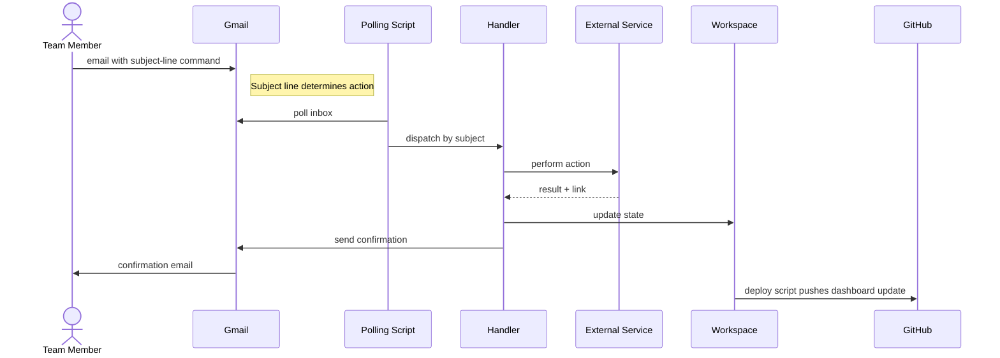

# 3. Command loop

[← architecture index](README.md) · [← docs home](../README.md)

Team members interact with Tony by email. A polling script reads `tony@austinvisuals.com`, dispatches to a handler based on the subject line, the handler acts against the relevant service, and a confirmation is sent back.

## Supported actions

Whitelisted senders can trigger the following by email:

- **File an attachment** to a project's Dropbox folder (`Upload <Project>`)
- **Create a new project folder** with the standard 7 subfolders (`New Project <Name>`)
- **Passively file attachments** from any thread Tony is CC'd or BCC'd on
- **Log status updates, check status, assign staff, set due dates** on projects
- **Generate an AI video** via Google Veo (`Generate video <Project>`)

Full command reference: [Emailing Tony](../guides/emailing-tony.md)

## Unsupported commands

The following are referenced in documentation but not yet implemented:

- `Dropbox transfer <Project> → <Owner>` — no handler
- `List client folders` — no handler
- `Voiceover request`, `Sound effect request`, `Generate music` — no email pipeline
- `Kling video — <Shot>` — CLI exists, no email glue
- `MAKE FORMAL` / `PERSONALIZE NOTES` — no drafting pipeline

## Notes

- The whitelist is `data/bot_whitelist.json` on the server. Adding a sender requires editing the file and reloading the runtime.
- Gmail uses OAuth; tokens live in the server's `secrets/` directory.
- Handler scripts are in `scripts/` in the workspace (~175 Python files). The live copy may differ from the 2026-04-01 snapshot.

---

**Prev:** [← Publish loop](02-publish-loop.md) · **Back to:** [Architecture index](README.md)
