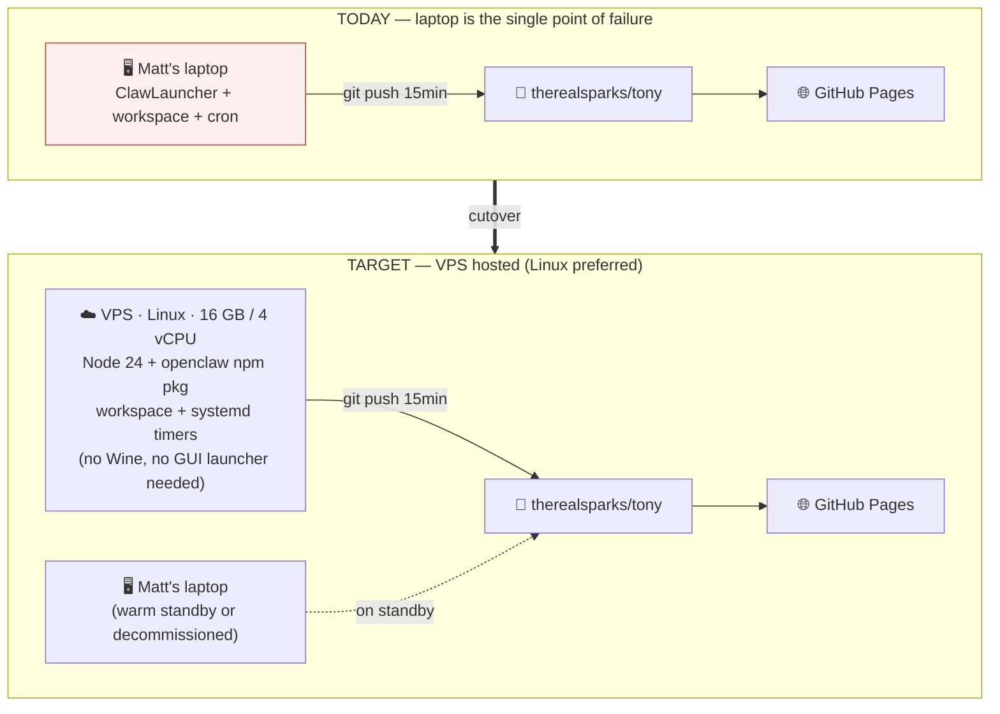

# 4. VPS migration — target state + cutover gotchas

[← architecture index](README.md) · [← docs home](../README.md)

The migration is essentially: lift the `laptop` box from [diagram 1](01-components.md) onto a server. Everything external stays the same. The only tricky part is the handoff — both machines must not be pushing to the `tony` repo at once.

## Cutover gotchas

1. **Secrets must exist on the VPS *before* first run** (`.openclaw/secrets/` — see [missing pieces](../migration/missing-pieces.md)).
2. **Stop the laptop's heartbeat cron before starting the VPS's,** or both machines will be pushing to the repo and we'll get merge conflicts on every cycle.
3. **Prefer Linux over Windows for the VPS.** OpenClaw is a Node app, so it runs natively on Linux. Re-register the Windows Task Scheduler jobs as `systemd` timers or `cron` entries. Avoid Wine emulation — it adds complexity and bugs for no real benefit.
4. **Do a fresh `npm install` on the VPS** — don't try to ship the `myclaw/node_modules/` folder across (it's ARM64 Windows builds of native addons like `sharp` and `node-llama-cpp`, which won't work on x64 Linux).
5. **`memory/` regenerates itself** — no need to migrate it.

## Rough cutover sequence (draft)

Not yet validated with Matt; this is the sketch we'd refine before actually pulling the trigger.

1. Provision Linux VPS (16 GB / 4 vCPU).
2. Install Node 24, Git, ffmpeg (for video watermark skill), Python 3.11+ (for handler scripts).
3. Clone a fresh sanitized workspace snapshot to `/opt/openclaw/workspace`.
4. Reconstruct `.openclaw/secrets/` from the credentials Matt hands off.
5. `npm install` inside the openclaw runtime directory.
6. Clone `therealsparks/tony` alongside so `deploy_*.py` has a push target.
7. Run `openclaw doctor` (or equivalent) to smoke-test the install.
8. Send a test email to `tony@austinvisuals.com` to confirm the command loop works end-to-end.
9. **Stop the laptop's cron jobs.** Verify no heartbeats are arriving from the laptop.
10. Start the VPS's cron/systemd timers. Verify the heartbeat commits are landing in the repo.
11. Monitor for ~24 hours.
12. Decommission the laptop install (or keep it around as a warm standby).

## Why this migration matters

The current architecture has Matt's personal laptop as a single point of failure. If his laptop is off, asleep, offline, or breaks, **Tony is offline** — and the team loses the email-filing, project-tracking, and dashboard-publishing they rely on. Moving to a VPS fixes that. It also lets us add real monitoring, logging, and eventually CI/CD.

---

**Prev:** [← Command loop](03-command-loop.md) · **Back to:** [Architecture index](README.md)
